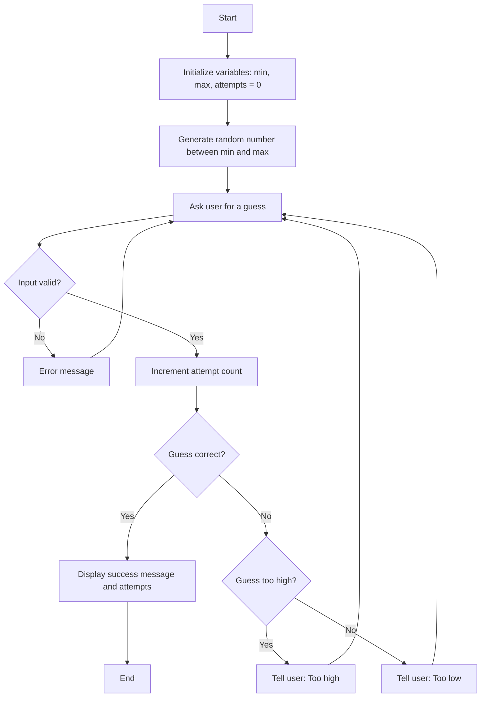

- Once the program starts, it moves on to block B where I define the range and set the variable attempts to 0.
- Computer generates a random number between a range, and it asks the user to guess said number
- The program considers if the user's input is within the range= (No: error message and loop back; yes: proceed to evaluate the guess)
- A guess is made, so increment var attempt count by 1
- Computer then consideres if the user's guess is equal to the number (yes: display attempts and success message; no: loop back and give specific feedback)
- Depending on the guess, the computer gives direct feedback (of whether the guess is to high or low)
